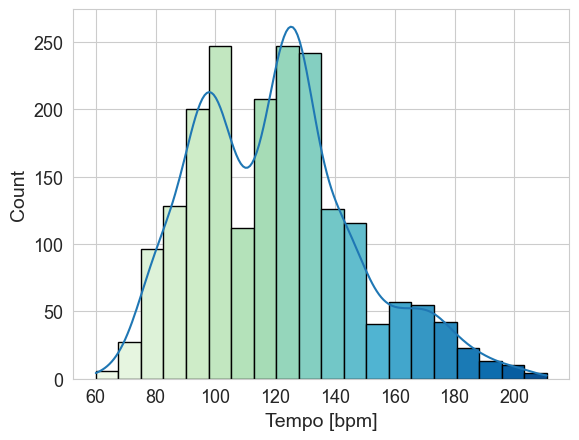
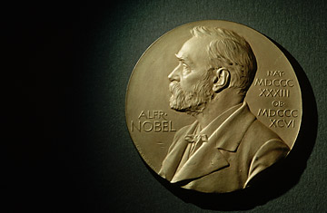
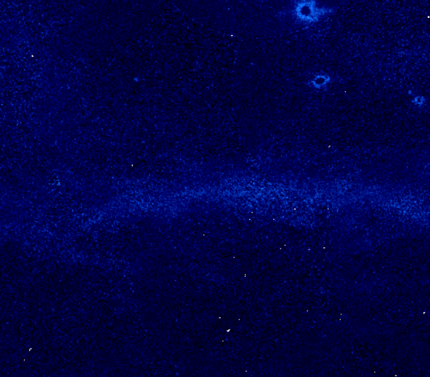
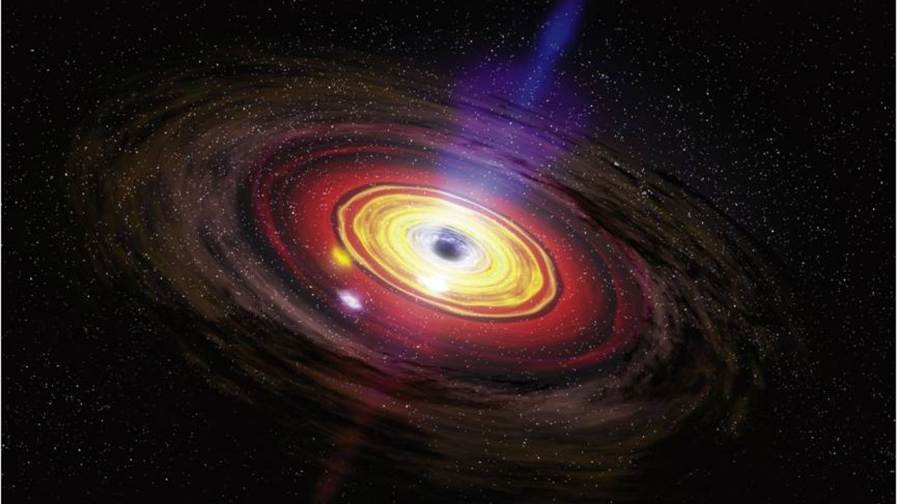
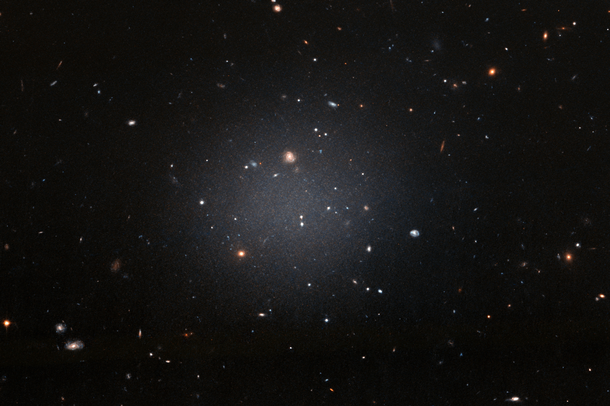
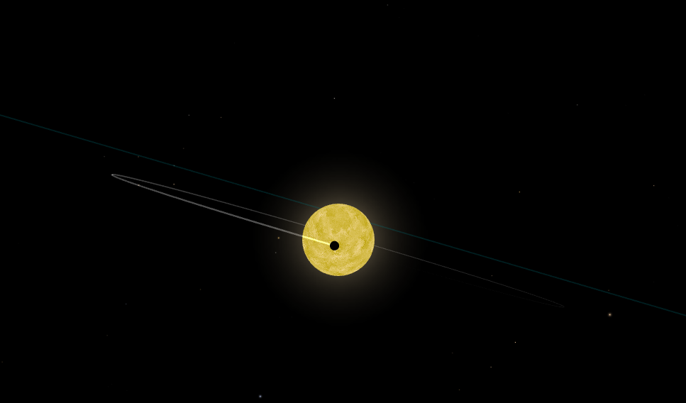

<h1 align="center"> Hello! Welcome to My Portfolio🌻</h1>

I am a recent college graduate with 3 years of statistical data analysis experience in Python, R, and Linux **seeking employment!**  
- 🔭 I’m currently developing image-processing **Machine Learning Algorithm** to be used in research 🌌
- 🌱 I’m currently learning Tableau
- 💬 Ask me about my hyper custom Spotify playlist generator & research projects
- 📫 Reach me out at **hina0830g@gmail.com**
- 😄 Pronouns: she/her
- 🎷 Fun fact: I have a Minor in Music & I play Alto Saxophone (since 2012~)✨!

<h2 align="center"><b> 📖 About Me 📖</b></h2>

 
    
<b> I am a ... 👀</b>

    <ul>
        <li>:atom:  BS Physics Graduate, Class of 2023 </li>
        <li>📡 Former NASA Goddard Intern worked on Python data analysis </li>
        <li>🔭 ML Researcher in Astrophysics </li>
        <li>🎼 Musician & aspiring music data analyst </li>
    </ul>
 

**Find My ...**  
   

##
<h2 align="center"><b>💻 Skills 💻</b> </h2>

### Languages:

### IDEs and Libraries:

### Operating Systems:

### Others: 

<h2 align="center"><b> 🏫 Projects 🏫</b></h2>

##  [Spotify 2000-2019 Top Hits Audio Stats Analysis](https://github.com/hina0830g/Spotify-Top-Charts-Analysis) 
💬**Description:** 
Extracted an audio statistics dataset on Kaggle and used Python and R to perform trend analysis on top 2000 tracks on Spotify between '00-19. We identified critical patterns and transition of the music trends over 2 decades by running linear regression and hypothesis testing.  
🧰**Tools used:**  Python, R, SciPy, NumPy, seaborn, Matplotlib, Kaggle 
🔑**Keywords:** clustering, pattern recognition,  time series analysis, linear regression, predictive modeling, two-sample hypothesis test, data visualization 
[🗣️**Project presentation**](https://docs.google.com/presentation/d/1asW_ME-yh7RMnZsJwp18_0_Lb19hRCX5/edit?usp=drive_link&ouid=111899210983321629360&rtpof=true&sd=true)
 
#

##   [2D Particle Tracking & Random Walk Analysis](https://github.com/hina0830g/Random_Walk_Analysis)  
💬**Description:** Observed the random motions of 1 μm particles in solutions and tracked their locations over time from videos using OpenCV. I used the locations (coordinates) to calculate mean squared displacement and experimentally determined Avogadro's Number. A replication of 1926 Physics Nobel Prize experiment.  
🧰**Tools used:**  OpenCV, Python (Jupyter notebook), R (RStudio), SciPy, NumPy, Seaborn  
🔑**Keywords:** video analysis, image processing, object tracking, time series analysis, linear regression, error analysis, data visualization.  
[🗣️**Project presentation**](https://docs.google.com/presentation/d/1zoPF6esKpLIvcKp6EGz1OubzBa34gI1Ysxdli4kYFGo/edit?usp=sharing)  
#
##   [Space Image Processing with High-Performance Computing](https://github.com/hina0830g/GALEX_montage)  
💬**Description:** Queried space images (a set of 3780 x 3780 arrays), performed object detection and applied Gaussian filters, montaged the files to create mosaics. Rendered over 50GB of images using supercomputers called HPC.  
🧰**Tools used:** bash shell, SSH, HPC systems, Linux Python (Jupyter notebook), Pandas, NumPy  
🔑**Keywords:**  big data, supercomputers, parallel computing, image processing/analysis, object detection, multidimensional arrays 
 
#

##   [Linux Simulations & Data Analysis of Black Hole Environment](https://github.com/hina0830g/Summer2022_NASA_Goddard/tree/main)  
💬**Description:** Duration my summer internship at NASA, I ran numerical simulations of the gas near supermassive black hole in Linux and developed Python modules to analyze the simulation results. I developed data visualization codes to tell the story the interpretation of the results and findings.  
🧰**Tools used:**  Nano, Cloudy (Linux software), Python SciPy, NumPy, Matplotlib  
🔑**Keywords:** linux computing, numerical simulations, modelling, data visualizationm, documentation  
[🗣️**Project presentation**](https://docs.google.com/presentation/d/16yqPdSYZ2PommPl5Mye2Qg7igPNHcY4--4dA71-tooM/edit?usp=sharing)  

#

##   [Statistical Study of Ultra-diffuse Galaxies](https://github.com/hina0830g/Research/tree/master/UDGs)  
💬**Description:** Ran Python query to extract astronomical data taken by a telescope and performed statistical analysis on the extracted data. I calculated the weighted distribution and mean number of the galaxies within the given radius by performing power law fit & Monte Carlo simulations.  
🧰**Tools used:**  Python (Jupyter notebook), Astropy query, SciPy, NumPy, Matplotlib  
🔑**Keywords:** large query,  Monte Carlo, power-law fit, error analysis, data visualization, scientific writing  
[🗣️**Research Poster**](https://aas240-aas.ipostersessions.com/Default.aspx?s=58-75-41-D7-48-BC-58-35-A5-3F-A5-44-08-3B-36-CF#)  

#

##   [Time Series Analysis of Exoplanet & Animated Simulation ](https://github.com/hina0830g/Summer2022_NASA_Goddard/tree/main)  
💬**Description:** Wrote Python scripts that perform time series analysis on.txt files involving brightness of a star. Used Verlet integration to numerically solve 2nd order differential equation of motion and calculated orbital speed, force and more. Lastly, Matplotlib was used to create animations serving as simulation of the movement of the exoplanet.  
🧰**Tools used:**  Python (Spyder), SciPy, NumPy, Matplotlib  
🔑**Keywords:** Numerical Analysis, Verlet Integration, Time Series Analysis, Animation, Data Visualization  
[🗣️**Project Presentation**](https://docs.google.com/presentation/d/1g2RyK2_tuMdq62ASCVdIIQu7vu4UddExgxco-eRV1OE/edit?usp=sharing)  

<h2 align="center"><b>✍️ Papers ✍️</b></h2>

### Publications:
* [Systematically Measuring Ultra-Diffuse Galaxies (SMUDGes). IV. Ultra-Diffuse Satellites of Milky Way Analogs](https://arxiv.org/pdf/2303.00774.pdf) (Astrophysical Journal, 1st Author)
* [Systematically Measuring Ultra-Diffuse Galaxies (SMUDGes). V. Low Surface Brightness Satellites of L* Galaxies](https://aas240-aas.ipostersessions.com/Default.aspx?s=58-75-41-D7-48-BC-58-35-A5-3F-A5-44-08-3B-36-CF#) (American Astronomical Society 240th Annual Conference)
* [Determining Dispersal Mechanisms of Protoplanetary Disks Using Accretion and Wind
Mass Loss Rates](https://iopscience.iop.org/article/10.3847/2041-8213/ac50aa/pdf) (Astrophysical Journal, 5th Author)

### Project Reports:
* [2D Particle Tracking & Random Walk Analysis Report](https://drive.google.com/file/d/1kL2-4DdOWwz1NXxwDG3-ltJBXtw6vsh3/view?usp=drive_link)
* [Random Walk Simulation Analysis Report](https://drive.google.com/file/d/1wDcFMbgbpgFvdben4DCxqZSBu_MpHoCY/view?usp=drive_link)
* [Systematically Measuring Ultra-Diffuse Galaxies (SMUDGes). V. Low Surface Brightness Satellites of L* Galaxies](https://docs.google.com/presentation/d/1jx7ry6UWkJojYWGoRGDdcNWwMSWGbwd2/edit?usp=drive_link&ouid=111899210983321629360&rtpof=true&sd=true) (Research Poster)

<h2 align="center"><b>👩‍🎓 Education 👩‍🎓</b></h2>

### Degree:
:atom: Bachelor of Science In **Physics** from the University of Arizona  
### Minors:
🔭 Astronomy, 🔢 Mathematics, 🎹 Music

### Coursework:
| Subject | Course Name |
| :---: | --- |
| 🔢 **Math** | Calculus I-III, Differential Equation, Linear Algebra, Math Techniques (Probability Theory, Fourier Analysis, Complex Analysis) |
| :woman_technologist:**Programming** |  : Statistical Method in Data Science    : Computer Programming I, Big Data and Data Mining, Independent & Directed Research, Computational Physics |
| :atom: **Physics** | Statistical Mechanics, Mechanics I-II, Electricity & Magnetism I-III, Quantum Mechanics I-III, Nuclear Physics, 5 semesters of Physics lab |
| 🎹 **Music** | Music Theory I & II, Electronic Music production, Music Business, Vocal Techniques, Guitar Techniques I & II, Concert & Marching Band |

### 🏅 Awards: 

College of Science Galileo Circle Award | Academic Year '22-23  
Stewrd Observatory Bychinsky, A. Eliane Astronomy Scholarship | Academic Year '21-22  
Stewrd Observatory Bychinsky, A. Eliane Astronomy Scholarship | Academic Year '20-21  
Dean's List | Fall '21   
Dean's List | Spring '21 	  
Academic Distinction | Academic Year '19-20  
Honorable Mention | Spring '20  

<h2 align="center"><b>🎵 Finally...</b></h2>

 Check out my music on Sound Cloud! I  do everything from composition, recording, and mixing using Ableton Live 😺

 Check out the Python generated playlists my Spotify API algirthm created!  

### 🎧 Currently listening to

### Notes:
- [x] Avatar
- [x] Socials 
- [x] Align Skills section
- [ ] Format project section
- [ ] Edit octocat image & make it wider
- [ ] Spotify played_min tracking
- [ ] Add Spotify API under project
- [ ] Spotify 
- [x] Create repos for spring '23
- [ ] Create readme for existing repos
- [ ] Decorate
